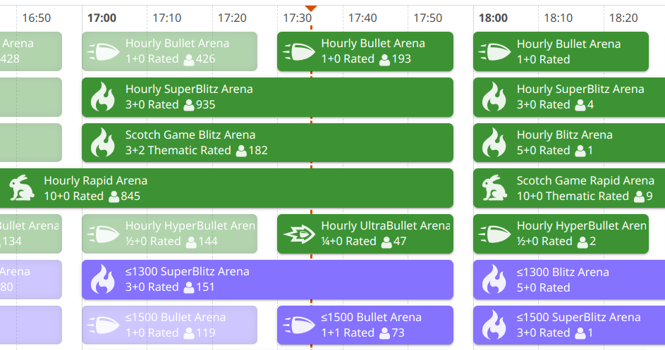

# Lichess Arena Attendance Prediction ♟️

A project that uses classic ML to predict the number of players who will join an online chess tournament on [Lichess.org](https://lichess.org).

### About the project

Lichess is a free and [open source](https://lichess.org/source) internet chess server. One of its most popular features is arena tournaments. Lichess holds all kinds of tournaments 24/7. However, not all tournaments are equally popular. This project aims to predict the number of participants of a Lichess arena tournament from its parameters such as chess variant, time control, frequency, duration, starting time, etc.



### Data

For this project I collected data on 257,164 arena tournaments held on Lichess from 2023-01-01 to 2024-12-15. The resulting dataset can be viewed in the [`data/tournament_dataset`](data/tournament_dataset) folder. It includes all tournament information currently obtainable from the Lichess API, except for any information on specific participants or results (since this information would typically not be available when predicting the attendance of a future tournament). The train and test sets were obtained with a random 90:10 split, stratified by tournament frequency.

All of the code that was used to make the dataset is in the [`data_collection`](data_collection) folder (see [Project structure](#project-structure) for more information on what each script does).

### Models

Here are the main models I trained as part of the project, along with their metrics on the test set. All models are from the [scikit-learn](https://scikit-learn.org/stable/) library.

| model | R² | MAPE | MAE | size |
|:-|:-:|:-:|:-:|:-:|
| Ridge regression, tuned $\alpha$ | 0.873 | 19.3% | 43.8 | 7.8 KB |
| Gradient boosting, default parameters | 0.950 | 11.9% | 23.4 | 0.5 MB |
| Gradient boosting, tuned parameters | 0.969 | **11.6%** | **21.4** | 2.1 MB |
| Random forest, default parameters | **0.979** | 12.3% | 22.5 | 425 MB |
| Random forest, smaller model | **0.979** | 12.9% | 25.4 | 32 MB |

### Installation

The project virtual environment can be set up with the following commands (assuming you have Python and Git installed):
```bash
git clone https://github.com/ludwig-n/lichess-arena-attendance-prediction.git
cd lichess-arena-attendance-prediction
python -m venv venv
source venv/bin/activate
pip install -r requirements.txt
```
After these steps, you should be able to run all the scripts and notebooks in the project. Note that scripts (.py files) should be run from the project root folder.

### Project structure

- [`data_collection`](data_collection): scripts that were used to download the data for the project and compile it into TSV dataset files.
    - [`get_tournament_lists.py`](data_collection/get_tournament_lists.py): downloads tournament lists from the [Lichess tournament history page](https://lichess.org/tournament/history) for a given time period and saves the available information in TSV format (note that this is not the final dataset format).
    - [`get_tournament_info.py`](data_collection/get_tournament_info.py): downloads detailed info on these tournaments from the Lichess API and saves it in NDJSON format.
    - [`make_dataset.py`](data_collection/make_dataset.py): converts the NDJSON files into a TSV dataset.

- [`data/tournament_dataset`](data/tournament_dataset): the dataset used for training the models, comprising all Lichess tournaments listed in the tournament history page from 2023-01-01 to 2024-12-15.

- [`preprocessing`](preprocessing): code for data preprocessing. This folder is installed as an editable module in the project virtual environment.

- [`eda`](eda): exploratory data analysis.
    - [`eda.ipynb`](eda/eda.ipynb): the main EDA notebook.
    - [`importances.ipynb`](eda/importances.ipynb): a notebook analyzing feature importances for the default random forest model.

- [`tuning`](tuning): hyperparameter tuning.
    - [`cv`](tuning/cv): cross-validation methods.
        - [`splitters.py`](tuning/cv/splitters.py): code for 4 hand-implemented cross-validation methods.
        - [`visualize_methods.ipynb`](tuning/cv/visualize_methods.ipynb): descriptions and visualizations for these methods.
        - [`compare_methods.ipynb`](tuning/cv/compare_methods.ipynb): a quality and performance comparison of these methods.
    - [`search.py`](tuning/search.py): a script that uses grid search and a genetic algorithm from the [gentun](https://github.com/gmontamat/gentun) library to perform hyperparameter search. Saves the results in pickle and CSV format.
    - [`grid_vs_genetic.ipynb`](tuning/grid_vs_genetic.ipynb): a comparison of the two hyperparameter search methods.
    - [`sensitivity.ipynb`](tuning/sensitivity.ipynb): an analysis of the gradient boosting model's sensitivity to different hyperparameters based on grid search results.

- [`training`](training): scripts that were used to train the models.
    - [`train_basic.py`](training/train_basic.py): trains 2 basic models (with default parameters): random forest and gradient boosting.
    - [`train_tuned_gb.py`](training/train_tuned_gb.py): trains a gradient boosting model with the best found hyperparameters.
    - [`train_small_rf.py`](training/train_small_rf.py): trains a smaller random forest model similar in quality to the basic model.
    - [`train_tuned_ridge.py`](training/train_tuned_ridge.py): trains a ridge regression model with the best found value of $\alpha$.

- [`models`](models): the trained models in pickle format. The basic random forest model is not included in the repository due to its large file size. However, there is a smaller alternative ([`random_forest_small.p`](models/random_forest_small.p)) that shows similar quality.

- [`app`](app): a web app that provides a friendly interface to the models.
    - [`README.md`](app/README.md): a more detailed description of the app components.
    - [`server/main.py`](app/server/main.py): code for the server, written in FastAPI.
    - [`client/main.py`](app/client/main.py): code for the client, written in Streamlit.
